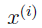
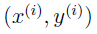
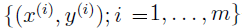
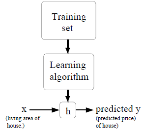

# Machine Learning

## Supervised learning

| notation | explanation |
| -------- | ----------- |
|  | "input" variables, or input features |
|  | "output" or target variable |
|  | a training example |
|  | a training set |

To describe the supervised learning problem slightly more formally, our goal is, given a training set, to learn a function h:X→Y so that h(x) is a “good” predictor for the corresponding value of y. For historical reasons, this function h is called a **hypothesis**. Seen pictorially, the process is therefore like this:  
  
When the target variable that we’re trying to predict is **continuous**, we call the learning problem a **regression problem**. When y can take on only a small number of **discrete** values, we call it a **classification problem**.