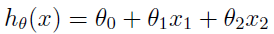
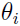
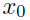
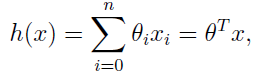

# Machine Learning

## Linear Regression

To perform supervised learning, we must decide how we’re going to represent functions/hypotheses h in a computer. As an initial choice, lets say
we decide to approximate y as a linear function of x:  
  
Here, the ’s are the **parameters** (also called **weights**) parameterizing the space of linear functions mapping from X to Y. To simplify our notation, we drop the θ subscript in _with_subscript_theta.png) and introduce the convention of letting  = 1 (this is the **intercept term**), so that  
  
where on the right-hand side above we are viewing θ and x both as vectors, and here n is the number of input variables (not counting ).  

**Now, given a training set, how do we pick, or learn, the parameters θ?** One reasonable method seems to be to make h(x) close to y, at least for the training examples we have. To formalize this, we will define a function that measures, for each value of the θ’s, how close the .png)’s are to the corresponding .png)’s. We define the **cost function**:  
  