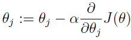
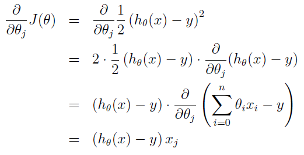
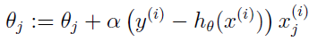
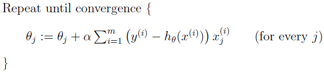
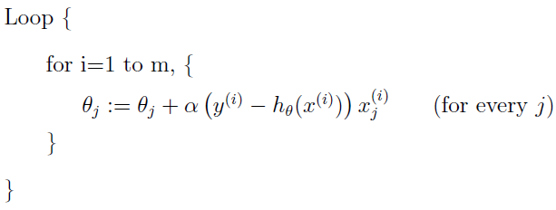

# Machine Learning

## Linear Regression

### LMS algorithm

We want to choose θ so as to minimize J(θ). To do so, let's use a search algorithm that starts with some "initial guess" for θ, and that repeatedly changes θ to make J(θ) smaller, until hopefully we converge to a value of θ that minimizes J(θ). Specifically, let's consider the **gradient descent** algorithm, which starts with some initial θ, and repeatedly performs the update:  
  
(This update is simultaneously performed for all values of j = 0, ..., n.) Here, α is called the **learning rate**. This is a very natural algorithm that repeatedly takes a step in the direction of steepest decrease of J.  

Lets first work partial derivative out for the case of if we have only one training example (x, y), so that we can neglect the sum in the definition of J. We have:  
  

For a single training example, this gives the update rule:  
  
This rule is called the LMS update rule (LMS stands for "least mean squares"), and is also known as the Widrow-Hoff learning rule.  

There are two ways to modify this method for a training set of more than one example.
-   **batch gradient descent**  
	  
	This method looks at every example in the entire training set on every step. Note that, while gradient descent can be susceptible to local minima in general  
-   **stochastic gradient descent** (also **incremental gradient descent**)  
	  
	In this algorithm, we repeatedly run through the training set, and each time we encounter a training example, we update the parameters according to the gradient of the error with respect to that single training example only. Often, stochastic gradient descent gets θ "close" to the minimum much faster than batch gradient descent. (Note however that it may never “converge” to the minimum, and the parameters θ will keep oscillating around the minimum of J(θ); but in practice most of the values near the minimum will be reasonably good approximations to the true minimum.) For these reasons, particularly when the training set is large, stochastic gradient descent is often preferred over batch gradient descent.