# Machine Learning

## Linear Regression

### The normal equations

In this method, we will minimize J by explicitly taking its derivatives with respect to the 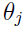’s, and setting them to zero, without resorting to an iterative algorithm

#### 1. Matrix derivatives

For a function f : 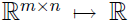 mapping from m-by-n matrices to the real numbers, we define the **derivative of f with respect to A** to be:  
  

For an n-by-n (square) matrix A, the **trace** of A is defined to be the sum of its diagonal entries:  
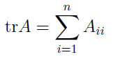  

Some properties of the trace operator are as follow. Here, A and B are square matrices, and a is a real number:  
-   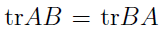  
	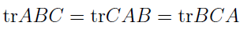  
	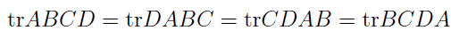
-	
-	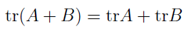
-	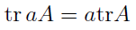

Some facts of matrix derivatives are as follow:  
-	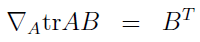
-	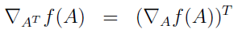
-	

To make our matrix notation more concrete, let us now explain in detail the meaning of the first of these equations. Suppose we have some fixed matrix B ∈ 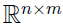. We can then define a function f :  according to f(A) = trAB. Note that this definition makes sense, because if A ∈ 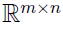, then AB is a square matrix, and we can apply the trace operator to it; thus, f does indeed map from .

#### 2. Least squares revisited

Armed with the tools of matrix derivatives, we begin by re-writing J in matrix-vectorial notation.  

Define the design matrix X to be the m-by-n matrix (actually m-by-n+1, if we include the intercept term) that contains the training examples’ input values in its rows:  
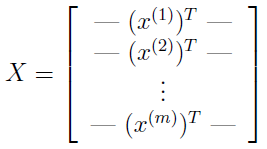  

Let 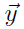 be the m-dimensional vector containing all the target values from the training set:  
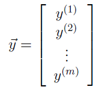  

Now, since 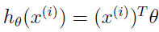, we can easily verify that:  
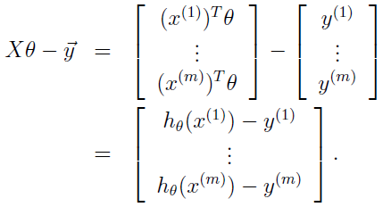  

Thus, we can get J(θ) through some tricks as follow:  
.png)  

Finally, to minimize J, lets find its derivatives with respect to θ. Hence, we can get that:  
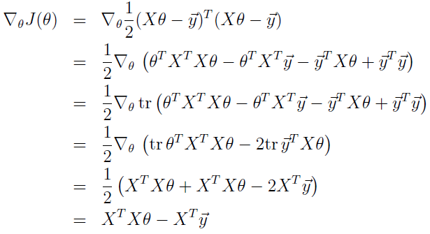  

To minimize J, we set its derivatives to zero, and obtain the normal equations:  
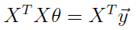  

Thus, the value of θ that minimizes J(θ) is given in closed form by the equation:  
.png)  
