# Machine Learning

## Linear Regression

### Probabilistic interpretation

When faced with a regression problem, why might linear regression, and specifically why might the least-squares cost function J, be a reasonable choice?  

Let us assume that the target variables and the inputs are related via the equation:  
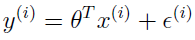  
where .png) is an error term that captures either unmodeled effects or random noise. Let us further assume that the .png) are distributed IID (independently and identically distributed) according to a Gaussian distribution (also called a Normal distribution) with mean zero and some variance 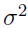. We can write this assumption as 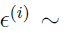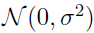. I.e., the density of  is given by:  
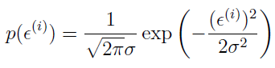  
This implies that:  
.png)  

Given X (the design matrix, which contains all the .png)’s) and θ, what is the distribution of the .png)’s? The probability of the data is given by 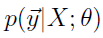. This quantity is typically viewed a function of 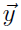 (and perhaps X), for a fixed value of θ. When we wish to explicitly view this as a function of θ, we will instead call it the **likelihood function**:  
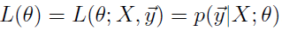  
Note that by the independence assumption on the .png)’s (and hence also the .png)’s given the .png)’s), this can also be written:  
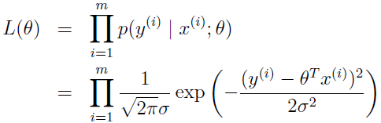  

The principal of **maximum likelihood** says that we should should choose θ so as to make the data as high probability as possible. I.e., we should choose θ to maximize L(θ). Since the derivations will be a bit simpler, we could maximize the **log likelihood** ℓ(θ) instead of maximizing L(θ):  
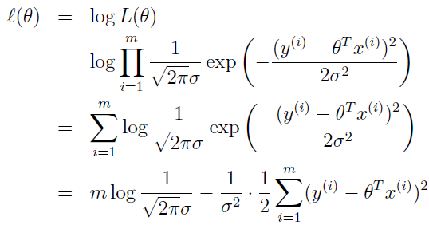  
Hence, maximizing ℓ(θ) gives the same answer as minimizing:  
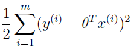  
which we recognize to be J(θ), our original least-squares cost function.  

To summarize: Under the previous probabilistic assumptions on the data, least-squares regression corresponds to finding the maximum likelihood estimate of θ. This is thus one set of assumptions under which least-squares regression can be justified as a very natural method that’s just doing maximum likelihood estimation.