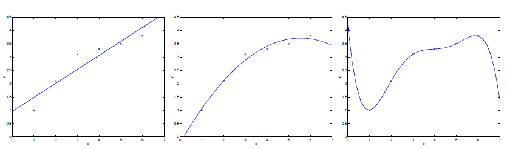
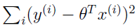
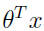
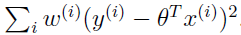
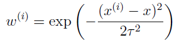
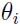

# Machine Learning

## Linear Regression

### Locally weighted linear regression

Without formally defining what these terms mean, we’ll say the figure on the left shows an instance of **underfitting**, in which the data clearly shows structure not captured by the model, and the figure on the right is an example of **overfitting**.  
  

**Locally weighted linear regression** (**LWR**) algorithm which, assuming there is sufficient training data, makes the choice of features less critical.  

In the original linear regression algorithm, to make a prediction at a query point x (i.e., to evaluate h(x)), we would:

1. Fit θ to minimize .
2. Output .

In contrast, the locally weighted linear regression algorithm does the following:

1. Fit θ to minimize .
2. Output .

Here, the .png)’s are non-negative valued **weights**. A fairly standard choice for the weights is:  
  
Note that the weights depend on the particular point x at which we’re trying to evaluate x. Hence, θ is chosen giving a much higher "weight" to the (errors on) training examples close to the query point x. The parameter τ, called the **bandwidth** parameter, controls how quickly the weight of a training example falls off with distance of its .png) from the query point x.  

Locally weighted linear regression is the first example we’re seeing of a **non-parametric** algorithm. The (unweighted) linear regression algorithm that we saw earlier is known as a **parametric** learning algorithm, because it has a fixed, finite number of parameters (the ’s), which are fit to the data. Once we’ve fit the ’s and stored them away, we no longer need to keep the training data around to make future predictions. In contrast, to make predictions using locally weighted linear regression, we need to keep the entire training set around.