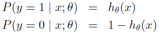
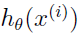

# Machine Learning

## Classification and logistic regression

For now, we will focus on the **binary classification** problem in which y can take on only two values, 0 and 1. For instance, if we are trying to build a spam classifier for email, then .png) may be some features of a piece of email, and y may be 1 if it is a piece of spam mail, and 0 otherwise. 0 is also called the **negative** class, and 1 the **positive** class, and they are sometimes also denoted by the symbols "-" and "+". Given .png), the corresponding .png) is also called the **label** for the training example.

### Logistic regression

Intuitively, it also doesn’t make sense for _with_subscript_theta.png) to take values larger than 1 or smaller than 0 when we know that y∈{0, 1}. To fix this, lets change the form for our hypotheses _with_subscript_theta.png). We will choose  
  
where  
.png)  
is called the **logistic function** or the **sigmoid function**. Here is a plot showing g(z):  
.png)  

For now, lets take the choice of g as given. Other functions that smoothly increase from 0 to 1 can also be used, but the choice of the logistic function is a fairly natural one. Before moving on, here's a useful **property** of the derivative of the sigmoid function, which we write a g′:  
  

So, given the logistic regression model, how do we fit θ for it? Lets endow our classification model with a set of probabilistic assumptions, and then fit the parameters via maximum likelihood.  

Let us assume that:  
  
Note that this can be written more compactly as:  
  

Assuming that the m training examples were generated independently, we can then write down the likelihood of the parameters as:  
  
As before, it will be easier to maximize the log likelihood:  
  

How do we maximize the likelihood? Similar to our derivation in the case of linear regression, we can use gradient ascent. Written in vectorial notation, our updates will therefore be given by . Lets start by working with just one training example (x, y), and take derivatives to derive the stochastic gradient ascent rule:  
  
Above, we used the fact that g′(z) = g(z)(1 − g(z)). This therefore gives us the stochastic gradient ascent rule:  
  
If we compare this to the LMS update rule, we see that it looks identical; but this is not the same algorithm, because  is now defined as a non-linear function of .

