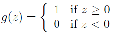
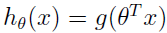
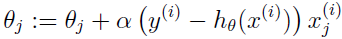

# Machine Learning

## Classification and logistic regression

### Digression: The perceptron learning algorithm

Consider modifying the logistic regression method to “force” it to output values that are either 0 or 1 or exactly. To do so, it seems natural to change the definition of g to be the threshold function:  
  
If we then let  as before but using this modified definition of g, and if we use the update rule：  
  
then we have the **perceptron learning algorithm**.  

In the 1960s, this "perceptron" was argued to be a rough model for how individual neurons in the brain work.  

Note however that even though the perceptron may be cosmetically similar to the other algorithms we talked about, it is actually a very different type of algorithm than logistic regression and least squares linear regression; in particular, it is difficult to endow the perceptron’s predictions with meaningful probabilistic interpretations, or derive the perceptron as a maximum likelihood estimation algorithm.