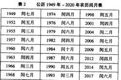

# STEP 3

## 任务说明

时间序列化：

1. 	增加时间属性：数据发布时间距上一个元旦过去了多少天，例如以2012-01-01为0，将时间变为以日期为单位的序列，如2012-01-23为22，2013-12-31为364。

2. 	增加时间属性：距上个农历新年过去了多少天，例如2012-01-23为0，2013-02-09为383，2013-02-10为0。为方便计算，可查清2012-2016年农历新年是哪一天，最好能去掉闰月，使下半年数据能一致。例如2013-02-09因为2012年有润四月，减去29天，应为354，如果觉得太麻烦就算了。  
	

## MATLAB脚本文件

| 脚本名 | 脚本描述 |
| --- | --- |
| step3.m | 主脚本。直接运行，根据提供的输入数据，可以得到相关输出数据 |

## 数据文件

| 文件名 | 文件描述 | 文件内容描述 |
| --- | --- | --- |
| input/digitized_farming.csv | 数值化后的数据文件。降部分属性数值化为自然数，去掉了不需要的属性 | 第一列为农产品市场所在省份，第二列为产品市场名称，第三列为农产品类别，第四列为农产品名称，第五列为平均交易价格，第六列为数据发布时间 |
| input/province_map.csv | 农产品市场所在省份的映射对的文件 | 第一列为农产品市场所在省份，第二列为映射的自然数 |
| input/market_map.csv | 农产品市场名称的映射对的文件 | 第一列为农产品市场名称，第二列为映射的自然数 |
| input/type_map.csv | 农产品类别的映射对的文件 | 第一列为农产品类别，第二列为映射的自然数 |
| input/name_map.csv | 农产品名称的映射对的文件 | 第一列为农产品名称，第二列为映射的自然数 |
| output/timed_digitized_farming.csv | 时间序列化和数值化后的数据文件 | 第一列为农产品市场所在省份，第二列为产品市场名称，第三列为农产品类别，第四列为农产品名称，第五列为平均交易价格，第六列为距离上个元旦天数，第七列为距离上个农历新年天数 |