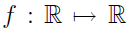
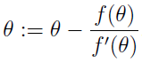
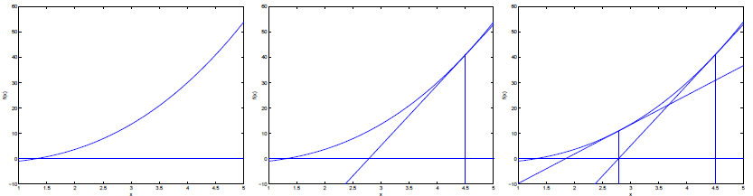
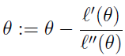
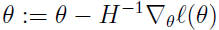
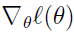
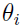
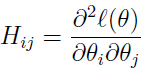

# Machine Learning

## Classification and logistic regression

### Another algorithm for maximizing ℓ(θ)

To get us started, lets consider Newton's method for finding a zero of a function. Specifically, suppose we have some function , and we wish to find a value of θ so that f(θ) = 0. Here, θ ∈ R is a real number. Newton’s method performs the following update:  
  
Here's a picture of the **Newton’s method** in action:  
  

Newton's method gives a way of getting to f(θ) = 0. What if we want to use it to maximize some function ℓ? The maxima of ℓ correspond to points where its first derivative ℓ′(θ) is zero. So, by letting f(θ) = ℓ′(θ), we can use the same algorithm to maximize ℓ, and we obtain update rule:  
  

Lastly, in our logistic regression setting, θ is **vector-valued**, so we need to generalize Newton's method to this setting. The generalization of Newton's method to this multidimensional setting (also called the **Newton-Raphson method**) is given by:  
  
Here,  is, as usual, the vector of partial derivatives of ℓ(θ) with respect to the ’s; and H is an n-by-n matrix (actually, n + 1-by-n + 1, assuming that we include the intercept term) called the **Hessian**, whose entries are given by:  
  

Newton’s method typically enjoys faster convergence than (batch) gradient descent, and requires many fewer iterations to get very close to the minimum. One iteration of Newton’s can, however, be more expensive than one iteration of gradient descent, since it requires finding and inverting an n-by-n Hessian; but so long as n is not too large, it is usually much faster overall. When Newton’s method is applied to maximize the logistic regression log likelihood function ℓ(θ), the resulting method is also called Fisher scoring.