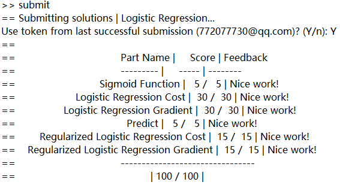

# Machine Learning

Today, I finished my programming assignment of **logistic regression** from Cousera. Fantastic~

## What I learned

1. 	Plot the data of the classification problem on a figure. The trick is to use **find(...)** or **logical array** as index.

2. 	Implement a program of logistic function (sigmoid function) using MATLAB.

3. 	Implement a program of the function costFunction(...) to compute cost and gradient for logistic regression.

4. 	Use a built-in function (**fminunc(...)**) to find the optimal parameters theta. It's like that:
	```
	%  Set options for fminunc
	options = optimset('GradObj', 'on', 'MaxIter', 400);

	%  Run fminunc to obtain the optimal theta
	%  This function will return theta and the cost
	[theta, cost] = fminunc(@(t)(costFunction(t, X, y)), initial_theta, options);
	```

5. 	Apply regularization on logistic regression, resulting costFunctionReg(...). There is a big hole in this item, which is that **DON'T** regularize the parameter θ(1) (in MATLAB).

## Submit snapshot
