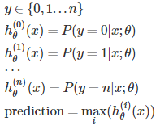
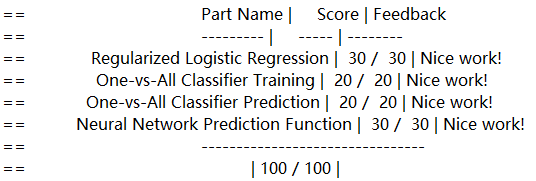

# Machine Learning

I finished my programming assignment of **Multi-class Classification** and **Neural Networks** from Cousera today.

## What I learned

1. 	Implement a program of **multi-class classification** (**one-vs-all classification**). We are basically choosing one class and then lumping all the others into a single second class. We do this repeatedly, applying binary logistic rgression to each case, and then use the hypothesis that returned the highest value as our prediction. It's like that:  
>	

2. 	In the progress, we used **fmincg(...)** working similarly to fminunc to find optimal theta, but is more more effcient for dealing with a large number of parameters.

3. 	Implement a program of predicting using the learned value of theta in previous step.

4. 	Given the learned value of theta, implement a program of predicting using **neural networks**. Keep in mind of using logistic function to compute output of every layer. (because I trapped into this hole

## Submit snapshot
