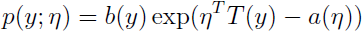
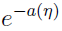
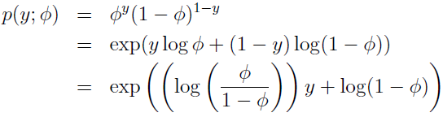
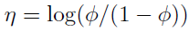
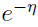
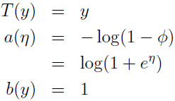
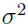
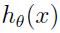
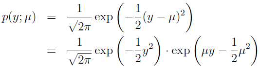
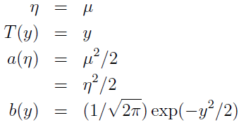

# Machine Learning

## Generalized Linear Models

### The exponential family

We say that a class of distributions is in the **exponential family** if it can be written in the form:  
  
Here, η is called the **natural parameter** (also called the **canonical parameter**) of the distribution; T(y) is the **sufficient statistic** (for the distributions we consider, it will often be the case that T(y) = y); and a(η) is the **log partition function**. The quantity  essentially plays the role of a normalization constant, that makes sure the distribution p(y; η) sums/integrates over y to 1.

A fixed choice of T, a and b defines a family (or set) of distributions that is parameterized by η; as we vary η, we then get different distributions within this family.

#### 1. Bernoulli distribution

The Bernoulli distribution with mean φ, written Bernoulli(φ), specifies a distribution over y ∈ {0, 1}, so that p(y = 1; φ) = φ; p(y = 0; φ) = 1 − φ. As we varying φ, we obtain Bernoulli distributions with different means. We now show that this class of Bernoulli distributions, ones obtained by varying φ, is in the exponential family; i.e., that there is a choice of T, a and b so that Equation (6) becomes exactly the class of Bernoulli distributions.

We write the Bernoulli distribution as:  
  
Now we have：  
 (which can be inverted as: φ = 1/(1 + ))  
  

#### 2. Gaussian distributions

Lets now move on to consider the Gaussian distribution. Recall that, when deriving linear regression, the value of  had no effect on our final choice of θ and . Thus, we can choose an arbitrary value for  without changing anything. To simplify the derivation below, lets set  = 1. We then have:  
  
Thus, we see that the Gaussian is in the exponential family, with:  
  

There're many other distributions that are members of the exponential family: The multinomial (which we’ll see later), the Poisson (for modelling count-data; also see the problem set); the gamma and the exponential (for modelling continuous, non-negative random variables, such as time-intervals); the beta and the Dirichlet (for distributions over probabilities); and many more.