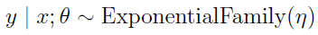
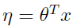
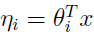

# Machine Learning

## Generalized Linear Models

### Constructing GLMs

More generally, consider a classification or regression problem where we would like to predict the value of some random variable y as a function of x. To derive a GLM for this problem, we will make the following three assumptions about the conditional distribution of y given x and about our model:

1. 	. I.e., given x and θ, the distribution of y follows some exponential family distribution, with parameter η.

2. 	Given x, our goal is to predict the expected value of T(y) given x. In most of our examples, we will have T(y) = y, so this means we would like the prediction h(x) output by our learned hypothesis h to satisfy h(x) = E[y|x].

3. 	The natural parameter η and the inputs x are related linearly: . (Or, if η is vector-valued, then .)

The third of these assumptions might seem the least well justified of the above, and it might be better thought of as a "**design choice**" in our recipe for designing GLMs, rather than as an assumption per se. These three assumptions/design choices will allow us to derive a very elegant class of learning algorithms, namely GLMs, that have many desirable properties such as ease of learning. Furthermore, the resulting models are often very effective for modelling different types of distributions over y.