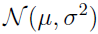
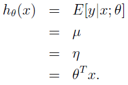
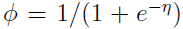
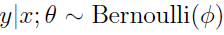
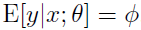
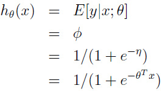
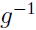

# Machine Learning

## Generalized Linear Models

### Constructing GLMs

#### Ordinary Least Squares

Consider the setting where the target variable y (also called the **response variable** in GLM terminology) is continuous, and we model the conditional distribution of y given x as as a Gaussian . (Here, μ may depend x.) So, we let the ExponentialFamily(η) distribution above be the Gaussian distribution. As we saw previously, in the formulation of the Gaussian as an exponential family distribution, we had μ = η. So, we have:  

#### Logistic Regression

Given that y is binary-valued, it therefore seems natural to choose the Bernoulli family of distributions to model the conditional distribution of y given x. In our formulation of the Bernoulli distribution as an exponential family distribution, we had . Furthermore, note that if , then . So, following a similar derivation as the one for ordinary least squares, we get:  
  

To introduce a little more terminology, the function g giving the distribution's mean as a function of the natural parameter (g(η) = E[T(y); η]) is called the **canonical response function**. Its inverse, , is called the **canonical link function**. Thus, the canonical response function for the Gaussian family is just the identify function; and the canonical response function for the Bernoulli is the logistic function.