# Machine Learning

## Generalized Linear Models

### Constructing GLMs

#### Softmax Regression

Consider a classification problemin which the response variable y can take on any one of k values, so y ∈ {1 2, . . . , k}. We will thus model it as distributed according to a multinomial distribution.

Lets derive a GLM for modelling this type of multinomial data. To do so, we will begin by expressing the multinomial as an exponential family distribution.

To parameterize a multinomial over k possible outcomes, one could use k parameters 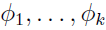 specifying the probability of each of the outcomes. However, these parameters would be redundant, or more formally, they would
not be independent (since knowing any k − 1 of the 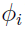’s uniquely determines the last one, as they must satisfy 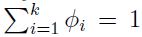. So, we will instead parameterize the multinomial with only k − 1 parameters, , where 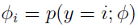, and 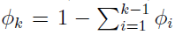. For notational convenience, we will also let 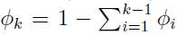, but we should keep in mind that this is not a parameter, and that it is fully specified by .

To express the multinomial as an exponential family distribution, we will define .png) as follows:  
_defination.png)  
For convention, We will write _i.png) to denote the i-th element of the vector T(y).

We introduce one more very useful piece of notation. An indicator function 1{·} takes on a value of 1 if its argument is true, and 0 otherwise (1{True} = 1, 1{False} = 0). So, we can also write the relationship between T(y) and y as _i_indicator.png). (Before you continue reading, please make sure you understand why this is true!) Further, we have that _i.png).

We are now ready to show that the multinomial is a member of the exponential family. We have:  
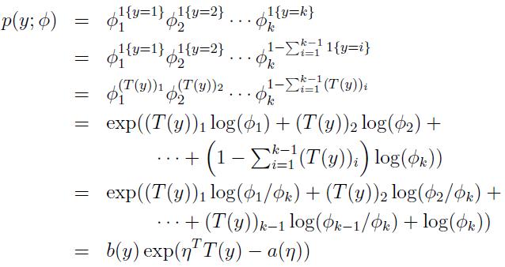  
where  
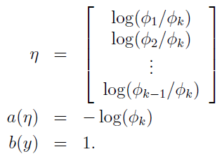

The link function is given (for i = 1, . . . , k) by:  
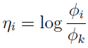  
For convenience, we have also defined 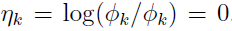. To invert the link function and derive the response function, we therefore have that: 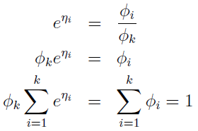. This implies that , which can be substituted back into the second above equation to give the response function:  
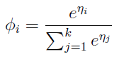  
This function mapping from the η’s to the φ’s is called the **softmax function**.