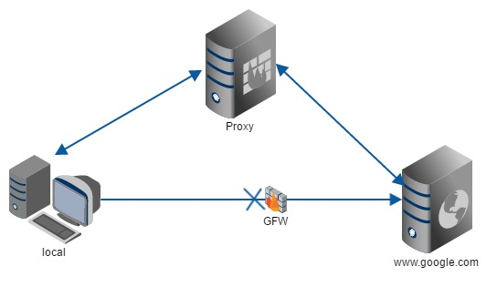
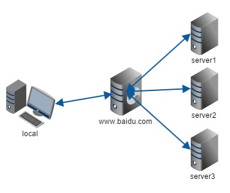

## Python 源代码编码问题

Python 源代码的默认编码是 ASCII。为了定义源代码的编码方法，可以在源代码的第一或第二行使用一个神奇的**注释**语句，例如：

```python
# coding=<utf-8>
```

或者这样（使用大多数流行编辑器支持的格式）：

```python
#!/usr/bin/python
# -*- coding: <utf-8> -*-
```

又或者这样：

```python
#!/usr/bin/python
# vim: set fileencoding=<utf-8> :
```

因为，第一或第二行必须匹配下面的正则表达式：

```
^[ \t\v]*#.*?coding[:=][ \t]*([-_.a-zA-Z0-9]+)
```

正则表达式的第一个分组会被解释成编码方法名。如果 Python 无法解释它，编译期间会报错。在这一行不能出现其他的 Python 语句。如果第一行匹配成功，第二行将不会在继续匹配。

## 防盗链

### 什么是防盗链系统

在确保地址正确的情况下，不能下载相应的资源，均是受到防盗链系统的影响，那么究竟什么是防盗链系统呢？防盗链自然就是防范盗链，所以这里先说一下什么是盗链。

**盗链**是指在自己的页面上展示一些并不在自己服务器上的内容。通常的做法是通过技术手段获得它人服务器上的资源地址，绕过别人的资源展示页面，直接在自己的页面上向最终用户提供此内容。比较常见的是一些小站盗用大站的资源（图片、音乐、视频、软件等），对于这些小站来说，通过盗链的方法可以减轻自己服务器的负担，因为真实的空间和流量均是来自别人的服务器。

**防盗链系统**就是防范盗链的系统，防止别人通过一些技术手段绕过本站的资源展示页面，盗用本站的资源，让绕开本站资源展示页面的资源链接失效。实施防盗链系统后，因为屏蔽了那些盗链的间接资源请求，从而可以大大减轻服务器及带宽的压力，也正如此，越来越多的站点都开始实施防盗链技术。

### 窥视防盗链

现在大家应该知道了为什么有真实地址仍然不能下载，这就是防盗链的作用。凡事必有因果，为什么可以防盗链呢，其实现原理是什么？防盗链又是如何实现的呢？

提到防盗链的实现原理就不得不从 HTTP 协议说起，在 HTTP 协议中，有一个表头字段叫 referer，采用 URL 的格式来表示从哪儿链接到当前的网页或文件。换句话说，通过 referer，网站可以检测目标网页访问的来源网页，如果是资源文件，则可以跟踪到显示它的网页地址。有了 referer 跟踪来源就好办了，这时就可以通过技术手段来进行处理，一旦检测到来源不是本站即进行阻止或者返回指定的页面。

如果想对自己的网站进行防盗链保护，则需要针对不同的情况进行区别对待。如果网站服务器用的是 Apache，那么使用 Apache 自带的 Url Rewrite 功能可以很轻松地防止各种盗链，其原理是检查 referer，如果 referer 的信息来自其他网站则重定向到指定图片或网页上。

如果服务器使用的是 IIS 的话，则需要通过第三方插件来实现防盗链功能了，现在比较常用的一款产品叫做 ISAPI_Rewrite，可以实现类似于 Apache 的防盗链功能。另外对于论坛来说还可以使用“登录验证”的方法进行防盗链。

## 正向代理和反向代理

两者的区别在于代理的对象不一样，**正向代理**代理的对象是客户端，**反向代理**代理的对象是服务端。

### 正向代理

A 同学在大众创业、万众创新的大时代背景下开启他的创业之路，目前他遇到的最大的一个问题就是启动资金，于是他决定去找马云爸爸借钱，可想而知，最后碰一鼻子灰回来了，情急之下，他想到一个办法，找关系开后门，经过一番消息打探，原来A同学的大学老师王老师是马云的同学，于是 A 同学找到王老师，托王老师帮忙去马云那借 500 万过来，当然最后事成了。不过马云并不知道这钱是A同学借的，马云是借给王老师的，最后由王老师转交给 A 同学。这里的王老师在这个过程中扮演了一个非常关键的角色，就是代理，也可以说是正向代理，王老师代替 A 同学办这件事，这个过程中，真正借钱的人是谁，马云是不知道的，这点非常关键。

我们常说的代理也就是只正向代理，正向代理的过程，它隐藏了真实的请求客户端，服务端不知道真实的客户端是谁，客户端请求的服务都被代理服务器代替来请求，科学上网工具 Shadowsocks 扮演的就是典型的正向代理角色。在天朝用浏览器访问 www.google.com 时会被无情的墙掉，要想翻阅这堵墙，你可以在国外用 Shadowsocks 来搭建一台代理服务器，让代理帮我们去请求 www.google.com，代理再把请求响应结果再返回给我。



### 反向代理

大家都有过这样的经历，拨打 10086 客服电话，一个地区的 10086 客服有几个或者几十个，你永远都不需要关心在电话那头的是哪一个，叫什么，男的，还是女的，漂亮的还是帅气的，你都不关心，你关心的是你的问题能不能得到专业的解答，你只需要拨通了10086 的总机号码，电话那头总会有人会回答你，只是有时慢有时快而已。那么这里的 10086 总机号码就是我们说的反向代理。客户不知道真正提供服务的人是谁。

反向代理隐藏了真实的服务端，当我们访问 www.baidu.com 的时候，就像拨打 10086 一样，背后可能有成千上万台服务器为我们服务，但具体是哪一台，你不知道，也不需要知道，你只需要知道反向代理服务器是谁就好了，www.baidu.com 就是我们的反向代理服务器，反向代理服务器会帮我们把请求转发到提供真实计算的服务器那里去。Nginx 就是性能非常好的反向代理服务器，它可以用来做负载均衡。



## 引用

- [PEP 263 -- Defining Python Source Code Encodings | Python.org](https://www.python.org/dev/peps/pep-0263/)
- [谈谈网站防盗链 - 越野苍狼的博客 - 51CTO技术博客](http://windyli.blog.51cto.com/1300305/315283)
- [正向代理与反向代理 - FooFish](https://foofish.net/proxy-and-reverse-proxy.html)
- [反向代理为何叫反向代理？ - 知乎](https://www.zhihu.com/question/24723688)